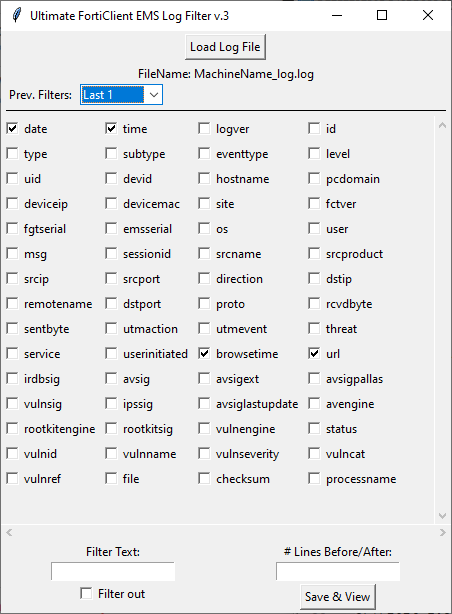

# Ultimate FortiClient EMS Log Filter
Quickly filter FortiClient logs based on specific criteria like source name (srcname), destination IP(dstip), url, and other criteria via checkboxes.

 Features include:
 1. Load a log file to parse key-value pairs from each log entry.
 2. Display checkboxes for each unique key found in the log file, to select which keys to include in the output.
 3. Filter Text - Filter by or filter out text. Only entries containing or not containing this text.
 4. Lines Before/After - Specify a number of contextual lines to include around each matching entry in the output.
 5. Save filtered results to a new file with a timestamp in the filename.
 6. Automatically opens the saved file in Notepad++ for quick viewing and further editing. 
 7. Memory feature - Saves filter checkboxes to config.txt

Usage:
 - Start the tool and use the "Load Log File" button to load the desired log file.
 - Select or deselect keys to include in the output by checking the corresponding boxes.
 - If needed, enter a filter text and specify whether to include or exclude entries with this text.
 - Specify the number of lines before and after matching entries to include for additional context.
 - Click "Save Selected" to save the filtered entries to a new file and automatically open this file in Notepad++.
 - This will also save the current checkboxes selected/not selected to config.txt for favorite keys

